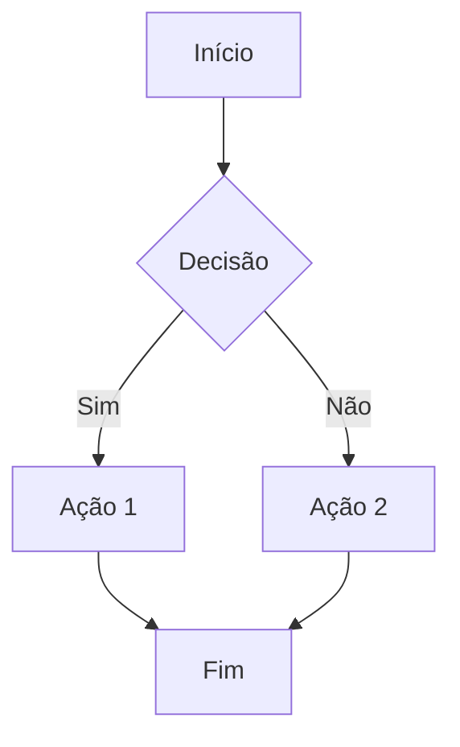

# 📝 Blog Nidio Dolfini - Documentação Completa

Um blog pessoal sobre tecnologia, DevOps e desenvolvimento, construído com Hugo e o tema Hugo Narrow.

## 🚀 Visão Geral

Este blog foi desenvolvido usando:
- **Hugo**: Gerador de sites estáticos escrito em Go
- **Tema**: [Hugo Narrow](https://github.com/tom2almighty/hugo-narrow) - Um tema moderno com múltiplos esquemas de cores
- **Deploy**: Configurado para deploy em produção
- **Linguagem**: Português brasileiro (pt-BR)

## 📁 Estrutura do Projeto

```
nidio-dev/
├── archetypes/          # Templates para novos conteúdos
├── assets/              # Recursos CSS/JS customizados
├── content/             # Todo o conteúdo do site
│   ├── _index.md       # Página inicial
│   ├── about.md        # Página sobre
│   ├── archives.md     # Página de arquivo
│   └── posts/          # Todos os posts do blog
├── data/               # Dados estruturados
├── hugo.toml          # Arquivo de configuração principal
├── i18n/              # Traduções
├── layouts/           # Templates customizados
│   ├── _partials/     # Componentes reutilizáveis
│   └── home.html      # Template da página inicial
├── static/            # Arquivos estáticos (imagens, favicon, etc.)
└── themes/            # Temas do Hugo
    └── hugo-narrow/   # Tema atual
```

## ⚙️ Configuração do hugo.toml

O arquivo `hugo.toml` é o coração da configuração do seu blog. Aqui está uma explicação detalhada de cada seção:

### Configurações Básicas

```toml
baseURL = 'https://nidio.dev/'           # URL do seu site em produção
languageCode = 'pt-BR'                   # Código do idioma
defaultContentLanguage = 'pt'           # Idioma padrão do conteúdo
title = 'Nidio Dolfini'                 # Título do site
theme = 'hugo-narrow'                   # Tema utilizado

hasCJKLanguage = false                  # Suporte para idiomas CJK (Chinês, Japonês, Coreano)
enableEmoji = true                      # Habilita emojis no conteúdo
```

### URLs Personalizadas (Permalinks)

```toml
[permalinks]
posts = '/posts/:slug/'                 # Posts ficam em /posts/nome-do-post/
pages = '/:slug/'                       # Páginas ficam em /nome-da-pagina/
```

### Paginação

```toml
[pagination]
pagerSize = 6                          # Número de posts por página
path = 'page'                          # URL da paginação (/page/2/, /page/3/, etc.)
```

### Taxonomias (Categorias e Tags)

```toml
[taxonomies]
category = 'categories'                # Habilita categorias
tag = 'tags'                          # Habilita tags
```

### Menu Principal

```toml
[[menus.main]]
name = 'Sobre'                        # Nome que aparece no menu
pageRef = '/about'                    # Página de destino
weight = 10                           # Ordem no menu (menor = primeiro)
[menus.main.params]
icon = 'about'                        # Ícone do menu
```

### Menu Social

```toml
[[menus.social]]
name = 'GitHub'                       # Nome da rede social
url = 'https://github.com/nidiodolfini' # URL do perfil
weight = 10                           # Ordem de exibição
[menus.social.params]
icon = 'github'                       # Ícone da rede social
```

### Parâmetros do Site

```toml
[params]
description = 'Site pessoal de desenvolvimento e tecnologia'
keywords = ['DevOps', 'Tecnologia', 'Programming', 'Cloud']
defaultAuthor = 'Nidio Dolfini'
language = 'pt-BR'
shortName = 'Nidio'                   # Nome curto para o botão circular

# Controles da Interface
showThemeSwitch = true                # Mostra seletor de tema
showDarkModeSwitch = true             # Mostra botão de modo escuro
showLanguageSwitch = false            # Mostra seletor de idioma
languageSwitchMode = 'dropdown'       # Tipo do seletor de idioma
stickyHeader = true                   # Header fixo no topo
dock = 'float'                        # Estilo do dock de navegação
colorScheme = 'orange'                # Esquema de cores (default, nord, dracula, orange)
```

### Configuração do Autor

```toml
[params.author]
name = 'Nidio Dolfini'
title = 'Um blog sobre tecnologias do meu o dia a dia'
description = '"Ninguém começa escrevendo bem. No começo, você escreve um lixo, mas acha que está ótimo… " - Octavia Butler'
showAvatar = false                    # Mostra avatar do autor
```

### Recursos Avançados

```toml
[params.katex]
enabled = true                        # Habilita fórmulas matemáticas

[params.mermaid]
enabled = true                        # Habilita diagramas Mermaid

[params.lightbox]
enabled = true                        # Habilita lightbox para imagens
loop = true                           # Loop nas imagens
width = '80vw'                        # Largura do lightbox
height = '80vh'                       # Altura do lightbox

[params.readingProgress]
enabled = true                        # Barra de progresso de leitura
height = 3                            # Altura da barra em pixels
showOnHomepage = false                # Mostra na página inicial
```

## 📝 Como Criar um Novo Post

### 1. Usando o Hugo CLI

```bash
hugo new posts/nome-do-seu-post.md
```

### 2. Estrutura do Frontmatter

Todo post deve começar com um frontmatter (metadados) entre `---`:

```yaml
---
title: "Título do Seu Post"                    # Título que aparece no site
description: "Descrição breve do post"         # Descrição para SEO e cards
date: 2024-01-27T10:00:00-03:00               # Data de publicação
categories: ["Categoria"]                      # Categorias do post
tags: ["tag1", "tag2", "tag3"]               # Tags do post
author: "Nidio Dolfini"                       # Autor do post
cover: "/images/posts/meu-post/cover.jpg"     # Imagem de capa (opcional)
draft: false                                   # false = publicado, true = rascunho
showFullContent: false                         # Mostra conteúdo completo na listagem
readingTime: true                             # Mostra tempo de leitura
hideComments: false                           # Esconde comentários
---
```

### 3. Escrevendo o Conteúdo

Após o frontmatter, escreva seu conteúdo em Markdown:

```markdown
# Título Principal

Seu conteúdo aqui...

## Subtítulo

Mais conteúdo...

### Subsubtítulo

- Lista item 1
- Lista item 2

**Texto em negrito** e *texto em itálico*.

[Link para algum lugar](https://exemplo.com)
```

## 🖼️ Trabalhando com Imagens

### Imagens de Capa dos Posts

Para adicionar uma imagem de capa que aparece nos cards dos posts (área destacada em verde), adicione no frontmatter:

```yaml
cover: "/images/posts/nome-do-post/capa.jpg"
```

### Estrutura de Pastas para Imagens

Organize suas imagens assim:

```
static/
└── images/
    ├── posts/
    │   ├── meu-primeiro-post/
    │   │   ├── capa.jpg
    │   │   ├── imagem1.jpg
    │   │   └── imagem2.jpg
    │   └── outro-post/
    │       └── cover.png
    └── geral/
        ├── avatar.jpg
        └── logo.svg
```

### 💡 Dica importante:
Sempre coloque as imagens na pasta `static/` e não na `public/`. O Hugo automaticamente copia tudo de `static/` para `public/` durante o build, e a pasta `public/` é regenerada a cada build.

### Inserindo Imagens no Conteúdo

#### Imagem Simples
```markdown

```

#### Galeria Justificada (Automática)
Coloque várias imagens em sequência sem linhas vazias entre elas:

```markdown


```

#### Galeria Masonry (Shortcode)
```markdown




```

### Configuração de Galeria

No `hugo.toml`, você pode configurar o comportamento das galerias:

```toml
[params.justified_gallery]
enabled = true                        # Habilita galeria justificada
rowHeight = 300                       # Altura das linhas
gutter = 30                          # Espaçamento entre imagens
lastRow = 'center'                   # Alinhamento da última linha
```

## 🎨 Recursos Avançados do Tema

### Alertas GitHub-style

```markdown
> [!NOTE]
> Esta é uma nota informativa.

> [!TIP]
> Esta é uma dica útil.

> [!IMPORTANT]
> Esta é uma informação importante.

> [!WARNING]
> Este é um aviso.

> [!CAUTION]
> Esta é uma precaução.
```

### Alertas Colapsáveis

```markdown
> [!NOTE]+ Título Clicável
> Conteúdo que pode ser expandido/recolhido.
```

### Fórmulas Matemáticas (KaTeX)

#### Inline
```markdown
A fórmula $E = mc^2$ é famosa.
```

#### Bloco
```markdown
$$
\int_{-\infty}^{\infty} e^{-x^2} dx = \sqrt{\pi}
$$
```

### Diagramas Mermaid

```markdown

```

### Blocos de Código com Colapso

Blocos de código longos (mais de 30 linhas) são automaticamente colapsáveis:

```python
def exemplo_longo():
    # Código com mais de 30 linhas
    # será automaticamente colapsável
    pass
```

## 🎯 Esquemas de Cores Disponíveis

O tema oferece vários esquemas de cores. Para alterar, modifique no `hugo.toml`:

```toml
colorScheme = 'orange'    # Opções: default, nord, dracula, orange
```

### Cores Disponíveis:
- **default**: Tons neutros
- **nord**: Paleta nórdica azul/cinza
- **dracula**: Tema escuro roxo
- **orange**: Tema laranja vibrante

## 🚀 Comandos Úteis

### Desenvolvimento Local
```bash
hugo server -D                       # Inicia servidor local com rascunhos
hugo server --bind 0.0.0.0          # Permite acesso externo
```

### Build para Produção
```bash
hugo --minify                        # Gera site otimizado
```

### Criar Conteúdo
```bash
hugo new posts/meu-novo-post.md      # Novo post
hugo new about.md                    # Nova página
```

### Gerenciar Tema
```bash
git submodule update --init --recursive  # Atualiza tema
```

## 📊 SEO e Performance

### Configurações de SEO
- Use `description` no frontmatter para meta descriptions
- Configure `keywords` no `hugo.toml`
- Adicione `cover` nos posts para Open Graph
- Use títulos hierárquicos (H1, H2, H3)

### Otimização de Imagens
- Use formatos modernos (WebP, AVIF)
- Comprima imagens antes de adicionar
- Use tamanhos apropriados (máximo 1920px de largura)

## 🔧 Personalização Avançada

### CSS Customizado
Adicione estilos personalizados em:
```
assets/css/custom/custom.css
```

### Templates Customizados
Override templates do tema criando arquivos em:
```
layouts/_partials/
layouts/posts/
layouts/
```

## 📚 Recursos e Referências

- [Documentação Hugo](https://gohugo.io/documentation/)
- [Hugo Narrow Docs](https://hugo-narrow-docs.vercel.app/) <mcreference link="https://hugo-narrow-docs.vercel.app/posts/markdown-enhanced.html" index="0">0</mcreference>
- [Markdown Guide](https://www.markdownguide.org/)
- [KaTeX Documentation](https://katex.org/)
- [Mermaid Documentation](https://mermaid.js.org/)

## 🐛 Solução de Problemas

### Problema: Imagens não aparecem
- Verifique se o caminho está correto
- Certifique-se que a imagem está na pasta `static/`
- Use caminhos absolutos começando com `/`

### Problema: Post não aparece
- Verifique se `draft: false`
- Confirme a data de publicação
- Execute `hugo server -D` para ver rascunhos

### Problema: Tema não carrega
- Execute `git submodule update --init --recursive`
- Verifique se o tema está na pasta `themes/`

## 📞 Suporte

Para dúvidas ou problemas:
- 📧 Email: nidio@dolfini.dev
- 🐙 GitHub: [@nidiodolfini](https://github.com/nidiodolfini)
- 💼 LinkedIn: [nidiodolfini](https://linkedin.com/in/nidiodolfini)

---

**Feito com ❤️ usando Hugo e Hugo Narrow**